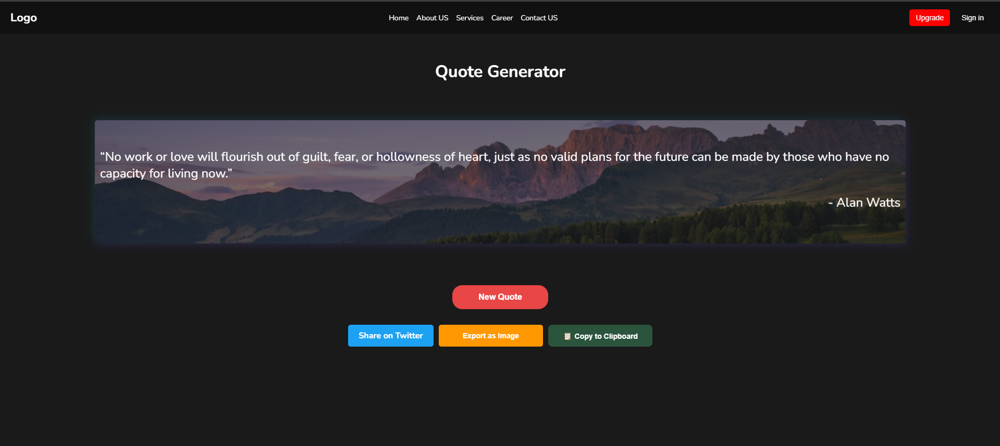

# Random Quote Generator

- A simple and elegant Random Quote Generator that fetches motivational quotes with a random background image. Users can share the quote on Twitter or copy it to their clipboard effortlessly.

## 🚀 Live Demo  

[Click here to view the live project](https://mg-quote-generator.netlify.app/){:target="_blank"}

## 🚀 Features

1️⃣ Generate a New Quote

- Click the "New Quote" button to fetch a new motivational quote from the API.

- Each time a quote is fetched, a random background image is also updated for a visually appealing experience.

2️⃣ Share on Twitter

- Clicking "Share on Twitter" copies the quote and author name.

- Redirects to Twitter with a pre-filled post modal, allowing you to easily share the quote.

3️⃣ Copy to Clipboard

- Click "Copy to Clipboard" to copy the quote and author's name.

- A success message is displayed confirming the copy action.

## 📸 Preview

## Technologies Used

- HTML - Structure of the webpage.

- CSS - Styling for a modern UI.

- JavaScript - Fetching API data, dynamic UI updates, and button functionalities.

- Free API - Fetching random quotes.

- Random Image API - Setting background images dynamically.

##  Installation & Usage

- Clone this repository:

- Navigate to the project folder:

- Open index.html in your browser and enjoy! 